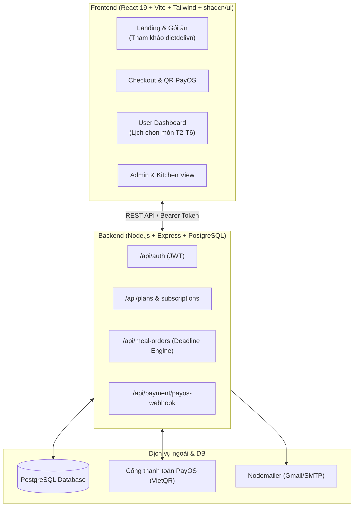
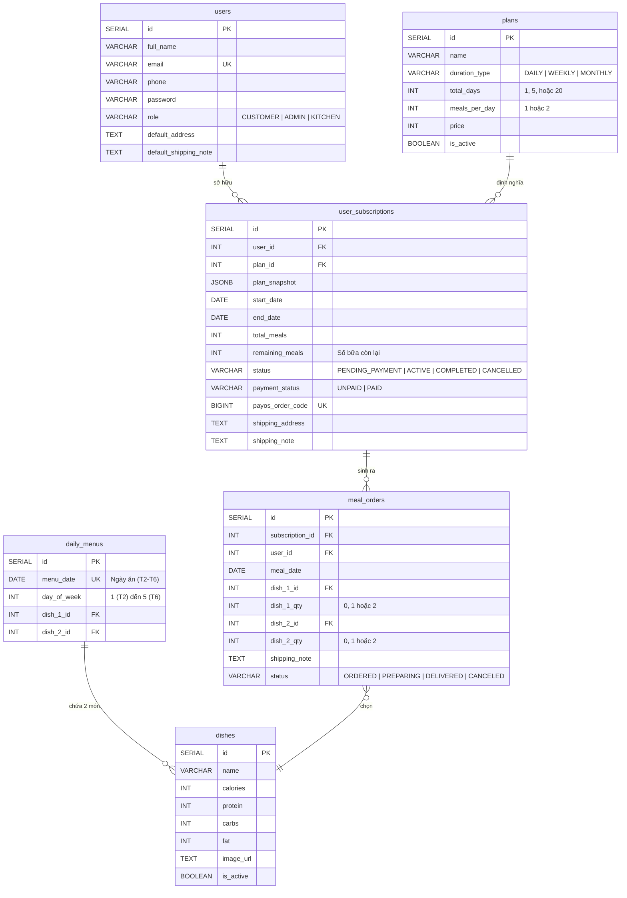

# KẾ HOẠCH PHÁT TRIỂN DỰ ÁN DIET DELI (POSTGRESQL + REACT + NODE.JS)

> **Mục tiêu:** Xây dựng nền tảng đặt suất ăn định kỳ (Food Subscription) với React + Tailwind/shadcn/ui, Node.js REST API, **PostgreSQL (Quan hệ)** và thanh toán tự động VietQR (PayOS).
> **Phân công:** 2 Lập trình viên Full-stack song song theo từng lát cắt tính năng (Vertical Slices), kế thừa dữ liệu và logic từ `dietdelivn`.

---

## I. TỔNG QUAN HỆ THỐNG & TECH STACK



* **Frontend:** React 19, TypeScript, Vite, Tailwind CSS, shadcn/ui, Lucide React, Axios, Zustand.
* **Backend:** Node.js, Express, **PostgreSQL (`pg` hoặc Prisma ORM)**, `@payos/node` (Thanh toán tự động VietQR), `bcryptjs`, `jsonwebtoken`, `moment-timezone`, `nodemailer`.
* **Ưu thế của PostgreSQL so với MongoDB trong dự án này:**
  - Logic của Diet Deli là **hợp đồng thuê bao (Subscription) + trừ hạn ngạch bữa ăn (`remaining_meals`) + giao dịch thanh toán**.
  - PostgreSQL hỗ trợ **Transaction ACID (`BEGIN ... COMMIT`)** và **Foreign Keys**, đảm bảo khi khách đổi món hoặc thanh toán sẽ không bao giờ bị lệch dữ liệu số bữa.
  - Cấu trúc rất tương đồng với MySQL trong `dietdelivn`, giúp hai bạn tái sử dụng gần như toàn bộ câu lệnh SQL và logic cũ!

---

## II. THIẾT KẾ CƠ SỞ DỮ LIỆU POSTGRESQL (SCHEMA DDL)

Dưới đây là thiết kế chuẩn 6 bảng quan hệ cho PostgreSQL:



### Script DDL khởi tạo (SQL):

```sql
-- 1. BẢNG USERS
CREATE TABLE users (
    id SERIAL PRIMARY KEY,
    full_name VARCHAR(100) NOT NULL,
    email VARCHAR(100) UNIQUE NOT NULL,
    phone VARCHAR(20) NOT NULL,
    password VARCHAR(255) NOT NULL,
    role VARCHAR(20) DEFAULT 'CUSTOMER', -- 'CUSTOMER', 'ADMIN', 'KITCHEN'
    default_address TEXT,
    default_shipping_note TEXT,
    created_at TIMESTAMP WITH TIME ZONE DEFAULT CURRENT_TIMESTAMP,
    updated_at TIMESTAMP WITH TIME ZONE DEFAULT CURRENT_TIMESTAMP
);

-- 2. BẢNG PLANS (Gói ăn mẫu)
CREATE TABLE plans (
    id SERIAL PRIMARY KEY,
    name VARCHAR(100) NOT NULL, -- Ví dụ: "Gói Tuần - 2 Bữa/Ngày"
    duration_type VARCHAR(20) NOT NULL, -- 'DAILY', 'WEEKLY', 'MONTHLY'
    total_days INT NOT NULL, -- DAILY: 1, WEEKLY: 5, MONTHLY: 20 (chỉ tính T2-T6)
    meals_per_day INT NOT NULL CHECK (meals_per_day IN (1, 2)),
    price INT NOT NULL, -- Giá gói (VND)
    description TEXT,
    is_active BOOLEAN DEFAULT TRUE,
    created_at TIMESTAMP WITH TIME ZONE DEFAULT CURRENT_TIMESTAMP
);

-- 3. BẢNG DISHES (Danh mục món ăn)
CREATE TABLE dishes (
    id SERIAL PRIMARY KEY,
    name VARCHAR(150) NOT NULL,
    calories INT,
    protein INT,
    carbs INT,
    fat INT,
    image_url TEXT,
    is_active BOOLEAN DEFAULT TRUE,
    created_at TIMESTAMP WITH TIME ZONE DEFAULT CURRENT_TIMESTAMP
);

-- 4. BẢNG DAILY_MENUS (Menu T2-T6, mỗi ngày đúng 2 món)
CREATE TABLE daily_menus (
    id SERIAL PRIMARY KEY,
    menu_date DATE UNIQUE NOT NULL,
    day_of_week INT NOT NULL CHECK (day_of_week BETWEEN 1 AND 5),
    dish_1_id INT NOT NULL REFERENCES dishes(id),
    dish_2_id INT NOT NULL REFERENCES dishes(id),
    created_at TIMESTAMP WITH TIME ZONE DEFAULT CURRENT_TIMESTAMP
);

-- 5. BẢNG USER_SUBSCRIPTIONS (Hợp đồng gói ăn khách mua)
CREATE TABLE user_subscriptions (
    id SERIAL PRIMARY KEY,
    user_id INT NOT NULL REFERENCES users(id) ON DELETE CASCADE,
    plan_id INT NOT NULL REFERENCES plans(id),
    plan_snapshot JSONB NOT NULL, -- Lưu cứng { name, duration_type, meals_per_day, price }
    start_date DATE NOT NULL,
    end_date DATE NOT NULL,
    total_meals INT NOT NULL,
    remaining_meals INT NOT NULL, -- Quota số suất ăn còn lại
    status VARCHAR(30) DEFAULT 'PENDING_PAYMENT', -- 'PENDING_PAYMENT', 'ACTIVE', 'COMPLETED', 'CANCELLED'
    payment_status VARCHAR(20) DEFAULT 'UNPAID', -- 'UNPAID', 'PAID'
    payment_method VARCHAR(20) DEFAULT 'PAYOS',
    payos_order_code BIGINT UNIQUE, -- Mã đơn PayOS
    paid_at TIMESTAMP WITH TIME ZONE,
    recipient_name VARCHAR(100) NOT NULL,
    shipping_phone VARCHAR(20) NOT NULL,
    shipping_address TEXT NOT NULL,
    shipping_note TEXT,
    created_at TIMESTAMP WITH TIME ZONE DEFAULT CURRENT_TIMESTAMP,
    updated_at TIMESTAMP WITH TIME ZONE DEFAULT CURRENT_TIMESTAMP
);

-- 6. BẢNG MEAL_ORDERS (Lựa chọn món từng ngày của khách)
CREATE TABLE meal_orders (
    id SERIAL PRIMARY KEY,
    subscription_id INT NOT NULL REFERENCES user_subscriptions(id) ON DELETE CASCADE,
    user_id INT NOT NULL REFERENCES users(id) ON DELETE CASCADE,
    meal_date DATE NOT NULL,
    dish_1_id INT REFERENCES dishes(id),
    dish_1_qty INT DEFAULT 0,
    dish_2_id INT REFERENCES dishes(id),
    dish_2_qty INT DEFAULT 0,
    shipping_note TEXT,
    status VARCHAR(30) DEFAULT 'ORDERED', -- 'ORDERED', 'PREPARING', 'DELIVERED', 'CANCELED'
    locked_at TIMESTAMP WITH TIME ZONE,
    created_at TIMESTAMP WITH TIME ZONE DEFAULT CURRENT_TIMESTAMP,
    updated_at TIMESTAMP WITH TIME ZONE DEFAULT CURRENT_TIMESTAMP,
    CONSTRAINT unique_sub_meal_date UNIQUE (subscription_id, meal_date),
    CONSTRAINT check_total_qty CHECK (dish_1_qty + dish_2_qty <= 2)
);
```

---

## III. SPRINT 0: CHUẨN BỊ NỀN TẢNG (1 - 2 NGÀY) - CẢ 2 CÙNG LÀM

### Task 0.1: Cấu trúc thư mục & Frontend Setup
* Cài đặt Tailwind CSS & cấu hình `dietdeli-2/client`.
* Thư mục `dietdeli-2/client/public/images` đã sẵn sàng 106 ảnh món ăn & banner từ bản cũ.

### Task 0.2: Kết nối PostgreSQL & Khởi tạo Bảng
* Tạo database `dietdeli` trên PostgreSQL cục bộ (Postgres App/pgAdmin/Docker) hoặc Cloud (Supabase / Neon / Aiven free tier).
* Chạy script SQL trên để tạo 6 bảng.
* Khởi tạo file kết nối DB trong `server/src/config/db.js`.

---

## IV. SPRINT 1: PHÁT TRIỂN LUỒNG CỐT LÕI (3 - 5 NGÀY) - TÁCH 2 NHÁNH

### NHÁNH A (DEV 1): ONBOARDING, GÓI ĂN, CHECKOUT & AUTH

#### Task A1: Authentication & User Profile (Full-stack)
* **Backend:**
  - `POST /api/auth/register`: INSERT vào `users`, băm mật khẩu `bcryptjs`.
  - `POST /api/auth/login`: SELECT từ `users`, so sánh bcrypt, ký JWT.
  - `GET /api/user/profile` & `PUT /api/user/profile`: Cập nhật `default_address`, `phone`, `default_shipping_note`.
* **Frontend:**
  - Trang Login / Register.
  - Zustand Store (`useAuthStore`) lưu Token & User.

#### Task A2: Xem & Chọn Gói Ăn (Plans & Pricing)
* **Backend:**
  - `GET /api/plans`: `SELECT * FROM plans WHERE is_active = true`.
  - Seed sẵn 6 gói ăn mẫu vào bảng `plans`.
* **Frontend:**
  - Pricing Cards theo thiết kế của `dietdelivn/views/main/baogia.ejs`.
  - Switch chuyển đổi 1 bữa / 2 bữa mỗi ngày.

#### Task A3: Trang Checkout & Tạo Đơn Chờ Thanh Toán
* **Backend:**
  - `POST /api/subscriptions/checkout`: 
    - Nhận `planId`, `startDate`, `shippingAddress`, `shippingNote`.
    - Sinh `payosOrderCode` duy nhất.
    - INSERT vào `user_subscriptions` với `status = 'PENDING_PAYMENT'`.
* **Frontend:**
  - Form Checkout nhập địa chỉ và note giao hàng. Chuyển hướng sang màn hình thanh toán.

---

### NHÁNH B (DEV 2): QUẢN LÝ MENU & BỘ MÁY CHỌN MÓN (BOOKING ENGINE)

#### Task B1: Quản trị Menu & Món ăn (Daily Menu System)
* **Backend:**
  - `GET /api/menu/current-week`: Lấy menu T2-T6 trong tuần kèm thông tin 2 món ăn (`JOIN dishes`).
  - `POST /api/admin/menu`: Admin xếp 2 món ăn cho từng ngày.
  - Seed danh mục món ăn mẫu vào bảng `dishes`.
* **Frontend:**
  - Tabs hiển thị thực đơn từ Thứ 2 đến Thứ 6.

#### Task B2: User Dashboard (Xem Gói & Suất Ăn Còn Lại)
* **Backend:**
  - `GET /api/subscriptions/my-active`: Lấy gói ăn đang active của user, trả về `remaining_meals`, ngày bắt đầu, ngày kết thúc.
* **Frontend:**
  - Banner hiển thị tên gói, tiến độ số bữa còn lại (`remaining_meals / total_meals`).

#### Task B3: Bảng Chọn Món Theo Ngày (Meal Selection Grid)
* **Quy tắc chọn:**
  - Gói 1 bữa: `dish_1_qty = 1` HOẶC `dish_2_qty = 1`.
  - Gói 2 bữa: `dish_1_qty = 1, dish_2_qty = 1` HOẶC `dish_1_qty = 2` HOẶC `dish_2_qty = 2`.
* **Backend:**
  - `POST /api/meal-orders/select`:
    - Dùng **PostgreSQL Transaction (`BEGIN ... COMMIT`)** để vừa INSERT/UPDATE vào `meal_orders`, vừa UPDATE `remaining_meals` trong `user_subscriptions`.
  - `GET /api/meal-orders/my-week`: Lấy danh sách các món user đã chọn trong tuần.
* **Frontend:**
  - Grid chọn món từng ngày (Tham khảo UI `dietdelivn/views/user/datmon.ejs`).

---

## V. SPRINT 2: LOGIC VẬN HÀNH & TỰ ĐỘNG HÓA (3 - 4 NGÀY)

### NHÁNH A (DEV 1): TỰ ĐỘNG HÓA THANH TOÁN (PAYOS WEBHOOK)

#### Task A4: Tích hợp Cổng thanh toán PayOS
* **Backend:**
  - Gọi `payOS.createPaymentLink({ orderCode, amount, description, returnUrl, cancelUrl })`.
  - Trả về mã QR VietQR.
* **Frontend:**
  - Màn hình hiển thị mã QR VietQR để khách quét qua app ngân hàng.

#### Task A5: PayOS Webhook & Kích hoạt Gói tự động
* **Backend:**
  - Endpoint `POST /api/payment/payos-webhook`:
    - Xác thực webhook: `payOS.verifyPaymentWebhookData(req.body)`.
    - `UPDATE user_subscriptions SET status = 'ACTIVE', payment_status = 'PAID', paid_at = NOW() WHERE payos_order_code = ...`.
  - Gửi email hóa đơn xác nhận qua Nodemailer.

---

### NHÁNH B (DEV 2): DEADLINE ENGINE & MÀN HÌNH BẾP/SHIPPER

#### Task B4: Logic Hạn Chót 12h Trưa & Khung Giờ Đặt Cả Tuần
* **Backend:**
  - Viết helper `canModifyMeal(targetDate)`:
    - Trong tuần: Hạn chót sửa món cho ngày hôm sau là **12:00 trưa ngày hôm trước**.
    - Cuối tuần: Từ **12:00 trưa Thứ 6 đến 12:00 trưa Chủ Nhật** mở khóa cho cả tuần sau.
  - Chặn tại `POST /api/meal-orders/select` nếu quá deadline.
* **Frontend:**
  - Hiển thị badge **"Đã khóa đơn"** sau 12h trưa.
  - Countdown thời gian còn lại để chọn món.

#### Task B5: Màn hình Vận hành Bếp & Shipper (Kitchen/Dispatch Dashboard)
* **Backend:**
  - `GET /api/kitchen/daily-report?date=YYYY-MM-DD`:
    - `SELECT dish_name, SUM(qty) GROUP BY dish_name`: Tổng hợp số suất bếp cần nấu.
    - `SELECT user, phone, address, note, dishes`: Danh sách shipper cần giao.
* **Frontend:**
  - Bảng tổng hợp số món cho bếp và bảng danh sách giao hàng cho shipper.

---

## VI. SPRINT 3: TỔNG DUYỆT & DEPLOY (2 - 3 NGÀY)
* Ghép nối E2E: Đăng ký -> Mua gói -> Quét QR PayOS -> Webhook kích hoạt -> Đặt món -> Khóa đơn sau 12h -> Bếp xuất danh sách.
* Deploy: Frontend (Vercel), Backend (Render/Railway), Database (Supabase / Neon / Render PostgreSQL).
