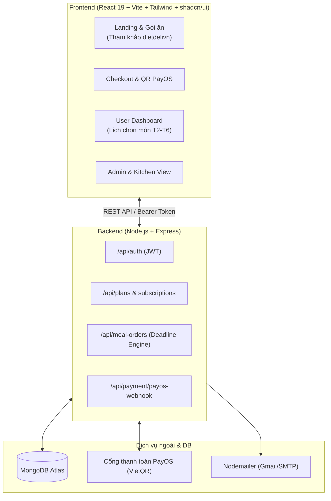

# KẾ HOẠCH PHÁT TRIỂN DỰ ÁN DIET DELI (MÔ HÌNH FULL-STACK VERTICAL SLICE)

> **Mục tiêu:** Xây dựng nền tảng đặt suất ăn định kỳ (Food Subscription) với React + Tailwind/shadcn/ui, Node.js REST API, MongoDB và thanh toán tự động VietQR (PayOS).
> **Phân công:** 2 Lập trình viên Full-stack song song theo từng lát cắt tính năng (Vertical Slices), tham khảo thiết kế và logic từ `dietdelivn`.

---

## I. TỔNG QUAN HỆ THỐNG & TECH STACK



* **Frontend:** React 19, TypeScript, Vite, Tailwind CSS, shadcn/ui, Lucide React, Axios, Zustand / TanStack Query.
* **Backend:** Node.js, Express, Mongoose (MongoDB), `@payos/node` (Thanh toán tự động VietQR), `bcryptjs`, `jsonwebtoken`, `moment-timezone`, `nodemailer`.
* **Tài nguyên kế thừa:** 
  - Ảnh, logo, banner: `dietdelivn/public/images/`
  - Design HTML/CSS mẫu: `dietdelivn/views/` (`index.ejs`, `baogia.ejs`, `datmon.ejs`, `account.ejs`)
  - Logic tính ngày & deadline: `dietdelivn/controllers/userController.js`

---

## II. SPRINT 0: CHUẨN BỊ NỀN TẢNG (1 - 2 NGÀY) - CẢ 2 CÙNG LÀM

Mục tiêu: Đưa dự án về chung chuẩn, không bị xung đột khi bắt đầu code song song.

### Task 0.1: Cấu trúc thư mục & Tài nguyên (Shared Setup)
* **Việc cần làm:**
  1. Thống nhất làm việc trong thư mục `dietdeli-2/` (hoặc di chuyển ra gốc):
     - `client/`: React + Vite + Tailwind CSS + shadcn/ui.
     - `server/`: Node.js Express.
     - `dietdelivn/`: Giữ nguyên làm thư mục tài liệu tham khảo.
  2. Copy toàn bộ ảnh từ `dietdelivn/public/images/` sang `client/public/images/` để sẵn sàng dùng cho các món ăn và banner.
  3. Cài đặt Tailwind CSS và khởi tạo shadcn/ui trên `client/`.
* **Acceptance Criteria:**
  - Chạy `npm run dev` ở cả client và server đều mượt mà.
  - Gọi được ảnh mẫu từ `/images/...` trên giao diện React.

### Task 0.2: Chuẩn hóa Quy ước API & Database (DB Conventions)
* **Việc cần làm:**
  1. Kết nối MongoDB Atlas trong `server/src/config/db.js`.
  2. Thống nhất định dạng JSON Response trả về từ Backend:
     ```json
     {
       "success": true,
       "data": { ... },
       "message": "Thông báo nếu có"
     }
     ```
  3. Khởi tạo 5 Model Mongoose cốt lõi: `User`, `Plan`, `DailyMenu`, `UserSubscription`, `MealOrder`.
* **Acceptance Criteria:**
  - Server kết nối thành công tới MongoDB.
  - Có middleware xử lý lỗi chung (Error Handler Middleware).

---

## III. SPRINT 1: PHÁT TRIỂN LUỒNG CỐT LÕI (3 - 5 NGÀY) - TÁCH 2 NHÁNH

Hai thành viên làm việc độc lập trên 2 nhánh Git: `feature/track-a` và `feature/track-b`.

```text
[Nhánh A - Dev 1]: Khách vào -> Xem gói -> Đăng ký/Đăng nhập -> Điền địa chỉ & ghi chú -> Tạo đơn
[Nhánh B - Dev 2]: Menu 2 món/ngày -> Dashboard khách -> Bảng lịch tuần -> Chọn món (1 hoặc 2 suất)
```

### NHÁNH A (DEV 1): ONBOARDING, GÓI ĂN, CHECKOUT & AUTH

#### Task A1: Authentication & User Profile (Full-stack)
* **Mục tiêu:** Đăng ký, đăng nhập tài khoản khách hàng, lưu địa chỉ giao hàng mặc định.
* **Tham khảo cũ:** `dietdelivn/controllers/userController.js` (`postLoginPage`, `postInfoEditPage`) và `views/user/login.ejs`.
* **Backend:**
  - `POST /api/auth/register`: Đăng ký tài khoản (mã hóa mật khẩu bằng `bcryptjs`).
  - `POST /api/auth/login`: Trả về JWT Token và User Info.
  - `GET /api/user/profile` & `PUT /api/user/profile`: Xem và sửa địa chỉ giao hàng, số điện thoại, ghi chú giao hàng mặc định.
  - Middleware `authMiddleware`: Xác thực Bearer JWT token.
* **Frontend:**
  - Modal hoặc trang Login / Register (shadcn/ui Dialog / Card).
  - Quản lý trạng thái đăng nhập bằng Zustand (`useAuthStore`: token, user, login, logout).
  - Tích hợp Axios Interceptor tự động gán Token vào Header.
* **Acceptance Criteria:**
  - User đăng ký và đăng nhập thành công, F5 không bị mất đăng nhập.

#### Task A2: Trang Giới thiệu Gói ăn (Plans & Pricing)
* **Mục tiêu:** Hiển thị 3 gói chính (Ngày, Tuần, Tháng) và 2 loại bữa (1 bữa hoặc 2 bữa/ngày).
* **Tham khảo cũ:** `dietdelivn/views/main/baogia.ejs` và `views/main/index.ejs`.
* **Backend:**
  - `GET /api/plans`: Danh sách các gói đang active.
  - Seed sẵn 6 gói mẫu vào MongoDB:
    1. Gói Ngày (1 bữa & 2 bữa)
    2. Gói Tuần 5 ngày T2-T6 (1 bữa & 2 bữa)
    3. Gói Tháng 20 ngày T2-T6 (1 bữa & 2 bữa)
* **Frontend:**
  - Trang Chọn gói ăn với UI thẻ giá (Pricing Cards) đẹp mắt, có nút chuyển đổi linh hoạt: **1 bữa/ngày** hoặc **2 bữa/ngày**.
  - Nút "Chọn gói này" chuyển thẳng sang trang Checkout kèm gói đã chọn.
* **Acceptance Criteria:**
  - Khách bấm chuyển qua lại giữa 1 bữa và 2 bữa, giá tiền và thông tin calo thay đổi tương ứng.

#### Task A3: Trang Checkout & Lưu thông tin đơn hàng
* **Mục tiêu:** Khách xác nhận gói ăn, ngày bắt đầu (startDate: Thứ 2 tuần tới), nhập địa chỉ nhận hàng và note giao hàng.
* **Backend:**
  - `POST /api/subscriptions/checkout`: Tạo bản ghi `UserSubscription` với trạng thái `PENDING_PAYMENT`.
* **Frontend:**
  - Form Checkout (shadcn Form / React Hook Form):
    - Tự động điền SĐT, Họ tên, Địa chỉ từ User Profile.
    - Trường "Ghi chú giao hàng" (Ví dụ: Giao trước 11h, gửi sảnh tòa nhà...).
    - Chọn ngày bắt đầu áp dụng gói (StartDate).
* **Acceptance Criteria:**
  - Bấm "Tiến hành thanh toán" tạo thành công bản ghi Subscription `PENDING_PAYMENT` và trả về `subscriptionId`.

---

### NHÁNH B (DEV 2): QUẢN LÝ MENU & BỘ MÁY CHỌN MÓN (BOOKING ENGINE)

#### Task B1: Quản trị Menu & Món ăn (Daily Menu System)
* **Mục tiêu:** Quản lý thực đơn từ Thứ 2 đến Thứ 6, mỗi ngày có đúng 2 món ăn.
* **Tham khảo cũ:** `dietdelivn/models/dailymenuitem.js`, `models/monan.js` và `controllers/adminController.js` (`getGanMonVaoMenu`).
* **Backend:**
  - `GET /api/menu/current-week`: Lấy menu của tuần hiện tại (hoặc tuần kế tiếp) theo cấu trúc từng ngày (T2-T6), mỗi ngày 2 món (Dishes).
  - `POST /api/admin/menu`: Endpoint cho Admin gán 2 món ăn vào từng ngày trong tuần.
  - Seed dữ liệu món ăn mẫu từ `dietdelivn/models/monan.js` vào MongoDB.
* **Frontend:**
  - Component hiển thị thực đơn tuần trực quan (Tabs từ Thứ 2 đến Thứ 6), mỗi tab hiển thị 2 thẻ món ăn kèm hình ảnh, calo, protein, carbs.
* **Acceptance Criteria:**
  - Lấy đúng dữ liệu 2 món cho mỗi ngày từ T2 đến T6.

#### Task B2: User Dashboard (Trạng thái gói ăn & Bữa còn lại)
* **Mục tiêu:** Khách sau khi đăng nhập xem được gói hiện tại của mình và số bữa còn lại.
* **Tham khảo cũ:** `dietdelivn/views/user/account.ejs`.
* **Backend:**
  - `GET /api/subscriptions/my-active`: Lấy gói ăn đang có hiệu lực của user, tính toán số suất ăn còn lại (`remaining_meals`), ngày bắt đầu và ngày kết thúc.
* **Frontend:**
  - User Dashboard Banner:
    - Hiển thị tên gói (VD: Gói Tuần - 2 Bữa/Ngày).
    - Progress Bar hoặc Badge số bữa còn lại: `X / 10 bữa`.
    - Hạn sử dụng của gói.
* **Acceptance Criteria:**
  - Khách chưa có gói -> hiển thị nút "Mua gói ngay".
  - Khách đã có gói -> hiển thị đầy đủ thông số gói.

#### Task B3: Giao diện & Logic chọn món theo ngày (Meal Selection Grid)
* **Mục tiêu:** Khách chọn món cho từng ngày theo đúng định mức gói.
* **Quy tắc:**
  - Gói 1 bữa: Chỉ được chọn 1 trong 2 món.
  - Gói 2 bữa: Được chọn 2 món khác nhau (A + B) HOẶC 1 món 2 lần (2 x A hoặc 2 x B).
  - Có ô ghi chú riêng cho từng ngày (nếu khách muốn đổi địa chỉ tạm thời).
* **Tham khảo cũ:** `dietdelivn/views/user/datmon.ejs`.
* **Backend:**
  - `POST /api/meal-orders/select`: Lưu lựa chọn món của ngày đó. Kiểm tra hợp lệ: tổng số món phải bằng `mealsPerDay` của gói.
  - `GET /api/meal-orders/my-week`: Lấy danh sách các ngày trong tuần kèm trạng thái món đã chọn.
* **Frontend:**
  - Bảng tương tác theo ngày:
    - Với mỗi ngày, hiển thị 2 món (Món A, Món B).
    - Nút bấm/Counter tăng giảm số lượng (0, 1, 2) sao cho tổng không vượt quá số bữa/ngày.
    - Nút "Lưu lựa chọn ngày này".
* **Acceptance Criteria:**
  - Khách gói 1 bữa không thể chọn cùng lúc 2 món. Khách gói 2 bữa có thể chọn 2 đĩa Món A hoặc 1 A + 1 B. Lưu thành công vào DB.

---

## IV. SPRINT 2: LOGIC VẬN HÀNH & TỰ ĐỘNG HÓA (3 - 4 NGÀY)

### NHÁNH A (DEV 1): TỰ ĐỘNG HÓA THANH TOÁN (PAYOS WEBHOOK)

#### Task A4: Tích hợp Cổng thanh toán PayOS (Tạo mã VietQR)
* **Mục tiêu:** Sau khi tạo đơn, hệ thống tự động sinh mã VietQR của PayOS cho khách quét.
* **Cơ chế:**
  - Sử dụng SDK `@payos/node`.
  - Backend: Gọi `payOS.createPaymentLink({ orderCode, amount, description, returnUrl, cancelUrl })`.
  - Trả về `checkoutUrl` hoặc `qrCode` để hiển thị trên web.
* **Frontend:**
  - Màn hình thanh toán: Hiển thị mã VietQR chuyển khoản ngân hàng (có logo ngân hàng, số tiền chính xác, nội dung chuyển khoản).
  - Có cơ chế polling hoặc lắng nghe realtime: Khi thanh toán thành công, tự động chuyển sang trang "Thanh toán thành công! Bắt đầu chọn món ngay".
* **Acceptance Criteria:**
  - Bấm thanh toán hiện mã VietQR thật từ PayOS.

#### Task A5: PayOS Webhook & Kích hoạt gói tự động
* **Mục tiêu:** Khi khách quét mã chuyển khoản thành công, PayOS gửi Webhook sang server để kích hoạt gói ngay lập tức mà không cần người duyệt.
* **Backend:**
  - Endpoint `POST /api/payment/payos-webhook`:
    - Dùng `payOS.verifyPaymentWebhookData(req.body)` để đảm bảo tính an toàn chống làm giả request.
    - Tìm `UserSubscription` theo `orderCode`.
    - Cập nhật `status = 'ACTIVE'`, `payment.isPaid = true`.
    - Tính toán `remaining_meals` ban đầu (`totalDays * mealsPerDay`).
  - Gửi email xác nhận kèm hóa đơn cho user qua Nodemailer (kế thừa logic gửi mail trong `dietdelivn/controllers/userController.js`).
* **Acceptance Criteria:**
  - Quét tiền trên app ngân hàng (hoặc test Webhook trên Dashboard PayOS) -> DB tự động cập nhật gói thành `ACTIVE`, user vào dashboard thấy gói ngay.

---

### NHÁNH B (DEV 2): DEADLINE ENGINE & MÀN HÌNH BẾP/SHIPPER

#### Task B4: Logic Hạn Chót 12h Trưa & Khung Giờ Đặt Cả Tuần (The Core Engine)
* **Mục tiêu:** Tự động khóa không cho user sửa/hủy món khi đã qua deadline.
* **Quy tắc thời gian (Dựa trên `userController.js` cũ):**
  1. **Trong tuần:** Hạn chót sửa món cho ngày hôm sau là **12:00 trưa ngày hôm trước**.
  2. **Cuối tuần:** Từ **12:00 trưa Thứ 6 đến 12:00 trưa Chủ Nhật** là thời gian duy nhất được đặt/sửa món cho cả tuần kế tiếp.
* **Backend:**
  - Viết helper `canModifyMeal(targetDate)` kiểm tra thời gian thực (`moment.tz("Asia/Ho_Chi_Minh")`).
  - Chặn tại API `POST /api/meal-orders/select`: Nếu đã quá deadline -> Trả về lỗi 400: *"Đã quá 12h trưa, bếp đã chốt nguyên liệu cho ngày này!"*.
  - Xử lý trừ/hoàn trả `remaining_meals` khi user thay đổi hoặc hủy món ăn.
* **Frontend:**
  - Nếu ngày đó đã bị khóa -> Thẻ ngày hiển thị Badge màu xám **"Đã khóa đơn"**, disable nút sửa món.
  - Hiển thị đồng hồ đếm ngược (Countdown): *"Còn X giờ để chốt món ngày mai"*.
* **Acceptance Criteria:**
  - Mock giờ sau 12:00 trưa -> User không thể sửa được món của ngày mai.

#### Task B5: Màn hình Vận hành Bếp & Shipper (Kitchen/Dispatch Dashboard)
* **Mục tiêu:** Bếp và Shipper chỉ cần mở trang này mỗi sáng để biết cần nấu bao nhiêu suất và ship cho ai.
* **Backend:**
  - `GET /api/kitchen/daily-report?date=YYYY-MM-DD`:
    - Tổng hợp số lượng từng món (Ví dụ: 35 suất Ức gà, 28 suất Cá hồi).
    - Danh sách chi tiết từng đơn giao: Tên khách, SĐT, Địa chỉ, Món chọn, Ghi chú giao hàng.
* **Frontend:**
  - Bộ lọc chọn ngày (Mặc định là hôm nay hoặc ngày mai).
  - Bảng tổng hợp số lượng món cho đầu bếp chuẩn bị.
  - Bảng danh sách giao hàng cho shipper có nút đánh dấu "Đang giao" / "Đã giao".
* **Acceptance Criteria:**
  - Bếp thấy ngay tổng số đĩa cần nấu; Shipper thấy đầy đủ địa chỉ và ghi chú đặc biệt của khách.

---

## V. SPRINT 3: TỔNG DUYỆT, POLISH GIAO DIỆN & DEPLOY (2 - 3 NGÀY) - CẢ 2

* **Task 3.1 (Ghép nối E2E):** Hai bạn test chéo toàn bộ luồng từ đầu đến cuối:
  1. Đăng ký tài khoản mới.
  2. Chọn Gói Tuần (2 bữa/ngày) -> Điền địa chỉ & note -> Quét VietQR PayOS.
  3. Webhook kích hoạt thành công -> Nhận email xác nhận.
  4. Vào Dashboard -> Thấy có 10 bữa -> Lên lịch chọn món T2-T6.
  5. Test đổi món trước 12h và sau 12h.
  6. Vào màn hình Bếp xem số lượng và danh sách giao hàng.
* **Task 3.2 (Responsive & Polish UI):** So sánh lại với các màn hình của `dietdelivn`, tối ưu giao diện trên điện thoại di động (mobile-friendly).
* **Task 3.3 (Deployment):**
  - Frontend: Deploy lên **Vercel** (miễn phí, nhanh).
  - Backend: Deploy lên **Render** hoặc **Railway**.
  - Database: **MongoDB Atlas** (Cluster miễn phí M0).

---

## VI. QUY TẮC PHỐI HỢP GIT ĐỂ KHÔNG BỊ CONFLICT

1. **Phân chia Route & File rõ ràng:**
   - Dev 1 làm việc trên: `client/src/pages/auth/`, `client/src/pages/checkout/`, `server/src/routes/authRoutes.js`, `server/src/routes/subscriptionRoutes.js`, `server/src/services/payosService.js`.
   - Dev 2 làm việc trên: `client/src/pages/dashboard/`, `client/src/pages/kitchen/`, `server/src/routes/menuRoutes.js`, `server/src/routes/orderRoutes.js`, `server/src/services/deadlineEngine.js`.
2. **Commit thường xuyên:** Mỗi khi xong một task nhỏ, commit và push lên branch riêng (`git push origin feature/track-a`).
3. **Merge hàng ngày:** Cuối mỗi ngày, cả 2 cùng merge branch của mình vào `main` để cùng cập nhật code mới nhất của nhau.
