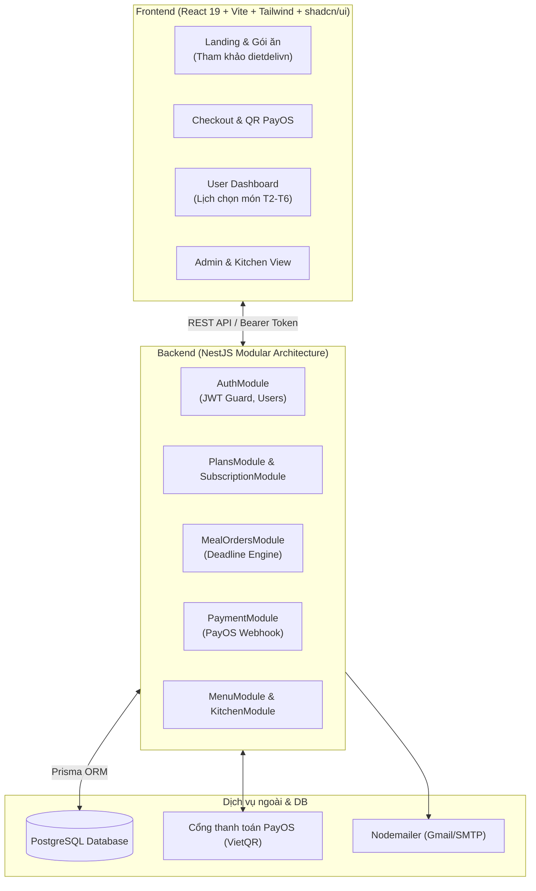
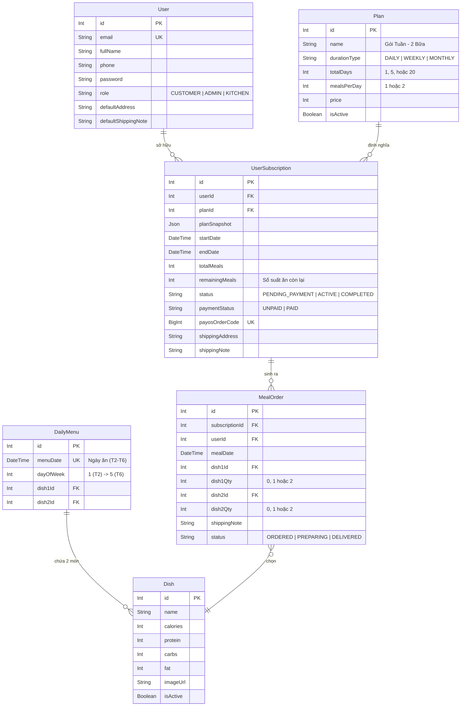

# DIET DELI - FOOD SUBSCRIPTION PLATFORM

> **Nền tảng đặt suất ăn dinh dưỡng định kỳ (Meal-Prep Subscription)**
> **Tech Stacks:** React 19 (Vite + Tailwind CSS + shadcn/ui) | NestJS (TypeScript) | PostgreSQL (Prisma ORM) | PayOS (VietQR)
> **Mô hình phối hợp:** 2 Lập trình viên Full-stack song song theo lát cắt tính năng (Vertical Slices).

---

## I. HƯỚNG DẪN KHỞI CHẠY DỰ ÁN (QUICKSTART)

### 1. Phía Frontend (`client/`)
```bash
cd client
npm install
npm run dev
# Mở trình duyệt tại: http://localhost:5173
```

### 2. Phía Backend (`server/`)
Khởi tạo NestJS (nếu chưa có) và cài đặt thư viện:
```bash
cd server
npm install
# Cấu hình file .env kết nối PostgreSQL và chạy migrate Prisma:
npx prisma db push
npm run start:dev
# API Base URL: http://localhost:3000/api
```

---

## II. KIẾN TRÚC TỔNG QUAN & PHÂN CHIA MODULE



---

## III. THIẾT KẾ DATABASE (PRISMA SCHEMA & POSTGRESQL)



### File cấu hình Prisma (`server/prisma/schema.prisma`):

```prisma
datasource db {
  provider = "postgresql"
  url      = env("DATABASE_URL")
}

generator client {
  provider = "prisma-client-js"
}

enum Role {
  CUSTOMER
  ADMIN
  KITCHEN
}

enum DurationType {
  DAILY
  WEEKLY
  MONTHLY
}

enum SubStatus {
  PENDING_PAYMENT
  ACTIVE
  COMPLETED
  CANCELLED
}

enum PayStatus {
  UNPAID
  PAID
  REFUNDED
}

enum OrderStatus {
  ORDERED
  PREPARING
  DELIVERED
  CANCELED
}

model User {
  id                  Int                @id @default(autoincrement())
  fullName            String             @map("full_name")
  email               String             @unique
  phone               String
  password            String
  role                Role               @default(CUSTOMER)
  defaultAddress      String?            @map("default_address")
  defaultShippingNote String?            @map("default_shipping_note")
  subscriptions       UserSubscription[]
  mealOrders          MealOrder[]
  createdAt           DateTime           @default(now()) @map("created_at")
  updatedAt           DateTime           @updatedAt @map("updated_at")

  @@map("users")
}

model Plan {
  id            Int                @id @default(autoincrement())
  name          String
  durationType  DurationType       @map("duration_type")
  totalDays     Int                @map("total_days")
  mealsPerDay   Int                @map("meals_per_day")
  price         Int
  description   String?
  isActive      Boolean            @default(true) @map("is_active")
  subscriptions UserSubscription[]
  createdAt     DateTime           @default(now()) @map("created_at")

  @@map("plans")
}

model Dish {
  id           Int         @id @default(autoincrement())
  name         String
  calories     Int?
  protein      Int?
  carbs        Int?
  fat          Int?
  imageUrl     String?     @map("image_url")
  isActive     Boolean     @default(true) @map("is_active")
  menuDish1    DailyMenu[] @relation("MenuDish1")
  menuDish2    DailyMenu[] @relation("MenuDish2")
  orderDish1   MealOrder[] @relation("OrderDish1")
  orderDish2   MealOrder[] @relation("OrderDish2")
  createdAt    DateTime    @default(now()) @map("created_at")

  @@map("dishes")
}

model DailyMenu {
  id        Int      @id @default(autoincrement())
  menuDate  DateTime @unique @map("menu_date") @db.Date
  dayOfWeek Int      @map("day_of_week")
  dish1Id   Int      @map("dish_1_id")
  dish2Id   Int      @map("dish_2_id")
  dish1     Dish     @relation("MenuDish1", fields: [dish1Id], references: [id])
  dish2     Dish     @relation("MenuDish2", fields: [dish2Id], references: [id])
  createdAt DateTime @default(now()) @map("created_at")

  @@map("daily_menus")
}

model UserSubscription {
  id              Int         @id @default(autoincrement())
  userId          Int         @map("user_id")
  planId          Int         @map("plan_id")
  planSnapshot    Json        @map("plan_snapshot")
  startDate       DateTime    @map("start_date") @db.Date
  endDate         DateTime    @map("end_date") @db.Date
  totalMeals      Int         @map("total_meals")
  remainingMeals  Int         @map("remaining_meals")
  status          SubStatus   @default(PENDING_PAYMENT)
  paymentStatus   PayStatus   @default(UNPAID) @map("payment_status")
  paymentMethod   String      @default("PAYOS") @map("payment_method")
  payosOrderCode  BigInt?     @unique @map("payos_order_code")
  paidAt          DateTime?   @map("paid_at")
  recipientName   String      @map("recipient_name")
  shippingPhone   String      @map("shipping_phone")
  shippingAddress String      @map("shipping_address")
  shippingNote    String?     @map("shipping_note")
  user            User        @relation(fields: [userId], references: [id], onDelete: Cascade)
  plan            Plan        @relation(fields: [planId], references: [id])
  mealOrders      MealOrder[]
  createdAt       DateTime    @default(now()) @map("created_at")
  updatedAt       DateTime    @updatedAt @map("updated_at")

  @@map("user_subscriptions")
}

model MealOrder {
  id             Int              @id @default(autoincrement())
  subscriptionId Int              @map("subscription_id")
  userId         Int              @map("user_id")
  mealDate       DateTime         @map("meal_date") @db.Date
  dish1Id        Int?             @map("dish_1_id")
  dish1Qty       Int              @default(0) @map("dish_1_qty")
  dish2Id        Int?             @map("dish_2_id")
  dish2Qty       Int              @default(0) @map("dish_2_qty")
  shippingNote   String?          @map("shipping_note")
  status         OrderStatus      @default(ORDERED)
  lockedAt       DateTime?        @map("locked_at")
  subscription   UserSubscription @relation(fields: [subscriptionId], references: [id], onDelete: Cascade)
  user           User             @relation(fields: [userId], references: [id], onDelete: Cascade)
  dish1          Dish?            @relation("OrderDish1", fields: [dish1Id], references: [id])
  dish2          Dish?            @relation("OrderDish2", fields: [dish2Id], references: [id])
  createdAt      DateTime         @default(now()) @map("created_at")
  updatedAt      DateTime         @updatedAt @map("updated_at")

  @@unique([subscriptionId, mealDate])
  @@map("meal_orders")
}
```

---

## IV. LỘ TRÌNH TRIỂN KHAI THEO SPRINT (VERTICAL SLICES)

### SPRINT 0: NỀN TẢNG (1 - 2 NGÀY) - CẢ 2 CÙNG LÀM
* **Frontend:**
  - Chuẩn hóa `client/` với Vite + Tailwind CSS + shadcn/ui.
  - Tận dụng kho 106 ảnh món ăn và banner có sẵn tại `client/public/images/`.
* **Backend:**
  - Khởi tạo NestJS bằng Nest CLI, cài đặt Prisma & tạo kết nối tới PostgreSQL.
  - Chạy `npx prisma db push` để sinh toàn bộ bảng.
  - Cấu hình `src/main.ts` bật CORS (`http://localhost:5173`), global prefix `/api`, và `ValidationPipe`.

---

### SPRINT 1: LUỒNG CỐT LÕI (3 - 5 NGÀY) - TÁCH 2 NHÁNH

#### NHÁNH A (DEV 1): `AuthModule`, `PlansModule`, `SubscriptionModule`
* **Backend NestJS:**
  - `AuthModule`: Đăng ký, đăng nhập JWT (`@nestjs/jwt`), băm mật khẩu (`bcryptjs`), `JwtAuthGuard`.
  - `PlansModule`: API lấy danh sách các gói ăn (`GET /api/plans`). Seed 6 gói mẫu vào DB.
  - `SubscriptionModule`: API tạo đơn mua gói (`POST /api/subscriptions/checkout`), sinh `payosOrderCode`, lưu vào `user_subscriptions`.
* **Frontend React:**
  - Trang Login / Register + Zustand Store (`useAuthStore`).
  - Trang Giới thiệu & Bảng giá gói ăn (tham khảo UI `dietdelivn/views/main/baogia.ejs`).
  - Trang Checkout: Form nhập địa chỉ và ghi chú giao hàng.

#### NHÁNH B (DEV 2): `MenuModule`, `OrdersModule`
* **Backend NestJS:**
  - `MenuModule`: API lấy thực đơn tuần (`GET /api/menu/current-week`), API admin gán 2 món cho mỗi ngày.
  - `OrdersModule`: API lưu lựa chọn món (`POST /api/meal-orders/select`), kiểm tra số lượng khớp với gói (1 bữa hoặc 2 bữa/ngày).
  - API lấy lịch ăn của khách (`GET /api/meal-orders/my-week`).
* **Frontend React:**
  - User Dashboard: Hiển thị gói đang kích hoạt, tiến độ số bữa còn lại (`remaining_meals`).
  - Grid Lịch chọn món T2-T6 trực quan (tham khảo UI `dietdelivn/views/user/datmon.ejs`).

---

### SPRINT 2: VẬN HÀNH & TỰ ĐỘNG HÓA (3 - 4 NGÀY)

#### NHÁNH A (DEV 1): `PaymentModule` (TỰ ĐỘNG HÓA PAYOS)
* **Backend NestJS:**
  - `PaymentModule`: Tạo link thanh toán VietQR qua `@payos/node`.
  - `POST /api/payment/payos-webhook`: Bắt webhook từ PayOS, xác thực chữ ký bảo mật, tự động cập nhật `user_subscriptions` thành `ACTIVE`.
  - Gửi email hóa đơn xác nhận thành công qua `nodemailer`.
* **Frontend React:**
  - Màn hình hiển thị mã QR VietQR PayOS để khách quét bằng ứng dụng ngân hàng.

#### NHÁNH B (DEV 2): DEADLINE ENGINE & `KitchenModule`
* **Backend NestJS:**
  - `DeadlineService`: 
    - Khóa sửa món sau **12:00 trưa ngày hôm trước**.
    - Cửa sổ mở đặt cho cả tuần: Từ **12:00 trưa Thứ 6 đến 12:00 trưa Chủ Nhật**.
  - `KitchenModule`: API thống kê số lượng từng món cần nấu và danh sách giao hàng cho shipper (`GET /api/kitchen/daily-report?date=YYYY-MM-DD`).
* **Frontend React:**
  - Badge "Đã khóa đơn" & Countdown thời gian còn lại trước 12h trưa.
  - Giao diện Admin/Bếp: Xem tổng số đĩa cần nấu và danh sách địa chỉ giao hàng.

---

### SPRINT 3: TỔNG DUYỆT & DEPLOY (2 - 3 NGÀY)
* Ghép nối E2E toàn bộ hệ thống từ mua gói -> thanh toán QR -> webhook kích hoạt -> đặt món -> khóa đơn sau 12h -> bếp xuất danh sách.
* Deploy: Frontend (Vercel), Backend (Render / Railway), PostgreSQL (Supabase / Neon / Render).

---

## V. QUY TẮC GIT & PHỐI HỢP NHÓM

1. **File `.gitignore`:** Đã cấu hình bỏ qua `node_modules/`, `.env`, `dist/`. Tuyệt đối không commit các file này.
2. **Quy tắc phân nhánh:**
   - Dev 1: làm trên branch `feature/track-a`
   - Dev 2: làm trên branch `feature/track-b`
3. **Merge hàng ngày:** Cuối mỗi ngày họp nhanh và merge code vào `main` để kiểm tra tích hợp.
